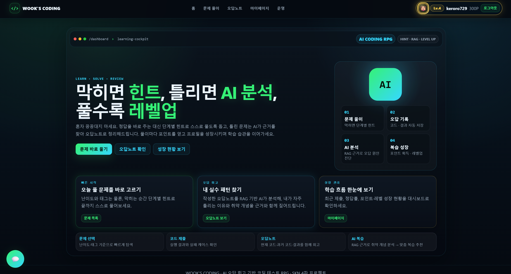
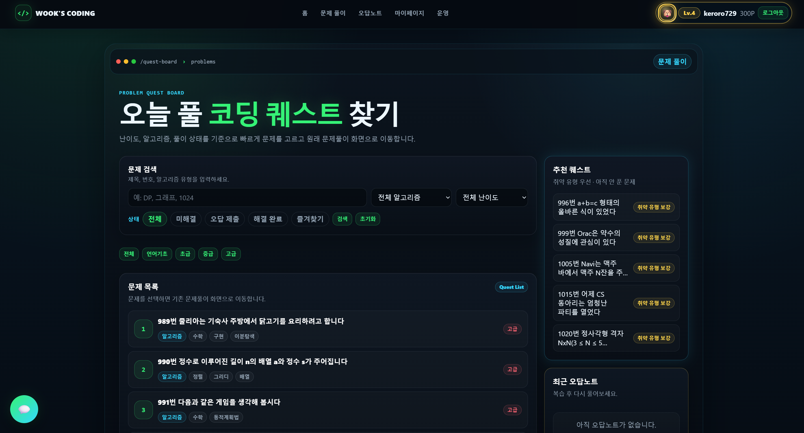
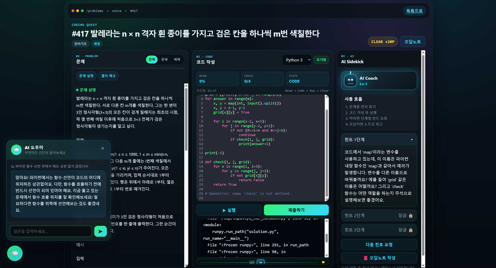
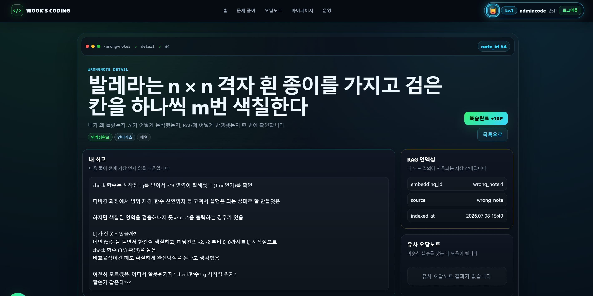
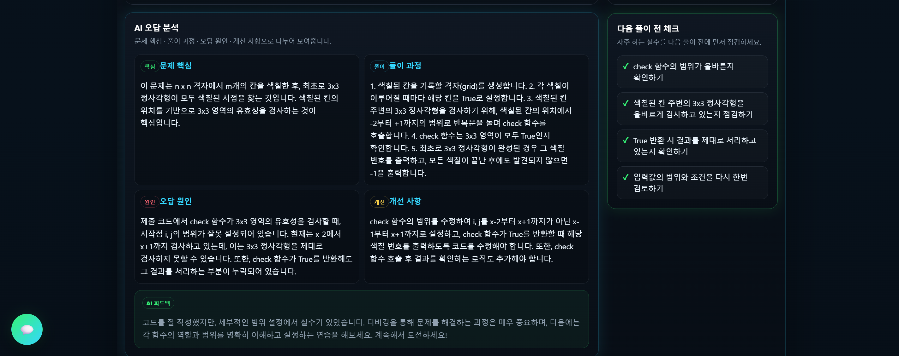
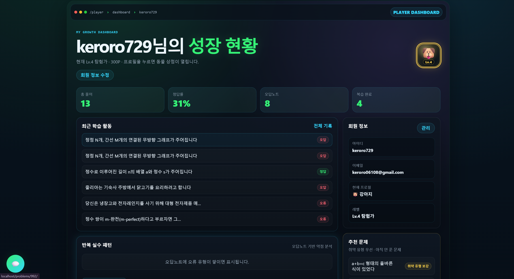

<div align="center">

# 🧑‍💻 WOOK'S CODING

**AI가 나의 학습을 기억하는 코딩 학습 플랫폼**

문제를 풀고 · 코드를 실행하고 · **AI 단계별 힌트**로 스스로 풀며 · **오답노트 RAG**로 취약점을 추적하는
AI 기반 코딩 학습 웹 애플리케이션 · *SKN 4차 프로젝트*

`Django 5` · `FastAPI` · `PostgreSQL` · `ChromaDB` · `OpenAI` · `Docker` · `AWS EC2/RDS`

</div>

---

## 📖 목차

1. [기획 의도](#-기획-의도)
2. [서비스 목표 · 핵심 기능](#-서비스-목표--핵심-기능)
3. [5개 전문 AI Agent](#-5개-전문-ai-agent)
4. [시스템 아키텍처 & 설계 이유](#️-시스템-아키텍처--설계-이유)
5. [핵심 기술 ① coding_state](#-핵심-기술--coding_state-사용자-상태-메모리)
6. [핵심 기술 ② 오답노트 RAG](#-핵심-기술--오답노트-rag)
7. [시연 화면](#️-시연-화면)
8. [디렉토리 구조](#-디렉토리-구조)
9. [실행 방법](#-실행-방법)
10. [배포 구조](#️-배포-구조)
11. [기술 스택](#️-기술-스택)
12. [설계 문서 · 참고](#-설계-문서--참고)

---

## 🎯 기획 의도

기존 AI 코딩 도구는 대부분 **"질문 하나에 답변 하나"** 로 끝납니다. 정답을 그대로 알려줘 스스로 사고할 기회를 빼앗고,
**내가 방금 무엇을 틀렸는지, 어떤 유형에 약한지를 기억하지 못합니다.**

WOOK'S CODING은 다르게 접근합니다.

- 정답을 바로 주는 대신 **단계별 힌트**로 끝까지 스스로 풀도록 돕고,
- 틀린 문제는 AI가 **근거(RAG)를 찾아 오답노트로 정리**하며,
- 학습 이력을 계속 모아 **AI가 요약한 학습 상태(coding_state)** 로 쌓아 **다음 학습에 다시 활용**합니다.

> **"AI가 이전 학습을 기억하고, 다음 학습에 활용한다."** — 이것이 이 서비스의 핵심 차별점입니다.

---

## 🏆 서비스 목표 · 핵심 기능

| 기능 | 설명 |
|---|---|
| **문제 풀이 · 코드 실행** | 격리 샌드박스에서 코드 실행 → 테스트케이스 채점, 실패 케이스 확인 |
| **AI 단계별 힌트** | 정답 대신 사고유도. 1→2→3단계로 스캐폴딩. 학습자 수준·약점에 맞춰 개인화 |
| **오답노트 + RAG** | 오답 회고 → AI 6섹션 분석 → 벡터 인덱싱 → 유사 오답·취약 개념 회수 |
| **coding_state 학습 메모리** | 제출·오답·질문·사고까지 요약한 사용자 상태를 모든 AI가 참고·갱신 |
| **미니튜터** | 학습 맥락(상태 + 최근 오답 + RAG)을 아는 대화형 튜터 |
| **테스트케이스 자동 생성** | 정답코드·제너레이터를 AI가 생성 → 샌드박스 실행으로 기대출력 산출 |
| **게이미피케이션** | 포인트·레벨·프로필(동물→드래곤)·미션으로 학습 습관 유지 |

---

## 🤖 5개 전문 AI Agent

하나의 거대한 AI 대신, **역할을 5개의 전문 Agent로 분리**하고 `coding_state`와 RAG로 유기적으로 협업시킵니다.

| Agent | 역할 | 핵심 |
|---|---|---|
| **테스트케이스 생성** | 정답코드·입력 생성 → 샌드박스 실행 → 기대출력 산출 | 생성 + 실행 + 크래시 디버그 루프 |
| **coding_state** | 학습 이력·사고를 요약해 사용자 상태 메모리 생성 | 집계 + LLM 요약 + **롤링 메모리** |
| **힌트** | 정답을 주지 않는 단계별 소크라테스식 힌트 | 수준/약점 개인화, 레벨 1~3 |
| **오답노트 + RAG** | 오답 6섹션 분석 + 유사 오답 검색 + 2단계 RAG 리포트 | 섹션 멀티청킹 리트리빙 |
| **미니튜터** | 학습 맥락 기반 멀티턴 대화 | 상태 + 최근 오답 + RAG 3중 개인화 |

> 각 Agent는 `coding_state`를 **참고**하고, 학습 활동은 다시 `coding_state`를 **갱신**하는 피드백 루프를 이룹니다.
> 상세: [`llm_wiki/11. ...AI_Agent_구조_및_핵심기술_v0.1.md`](llm_wiki/)

---

## 🏗️ 시스템 아키텍처 & 설계 이유

```
                          사용자
                            │  HTTP
                        ┌───▼────┐
                        │ Nginx  │  reverse proxy (외부 노출 지점)
                        └───┬────┘
                            │
        ┌───────────────────▼────────────────────┐         호출은 단방향 →
        │   Django  (웹·인증·권한·CRUD·서비스로직) │  ── X-Internal-API-Key ──┐
        │   ▸ PostgreSQL 원천 데이터의 쓰기 주인    │                          │
        └───────┬──────────────────────┬──────────┘                          │
                │ 쓰기                  │ jobs 위임                            ▼
        ┌───────▼───────┐      ┌────────▼────────┐          ┌──────────────────────────┐
        │  PostgreSQL   │      │  Worker (격리)  │          │  FastAPI  (AI/RAG 전용)   │
        │  (원천·정합성) │◀─────│ 도커 샌드박스   │          │  ▸ stateless (RDB 금지)   │
        └───────────────┘ poll │ 코드 실행       │          │  ▸ ChromaDB 쓰기 주인      │
                               └─────────────────┘          └───────┬─────────┬────────┘
                                                                    │         │
                                                            ┌───────▼──┐  ┌───▼─────┐
                                                            │ ChromaDB │  │ OpenAI  │
                                                            │ (임베딩) │  │  (LLM)  │
                                                            └──────────┘  └─────────┘
```

**왜 이렇게 설계했나 — 4가지 원칙**

1. **역할 분리 (Django ↔ FastAPI)**
   서비스 로직은 Django, AI/RAG는 FastAPI에 집약. **모델·프롬프트를 바꿔도 서비스 본체는 영향받지 않고**, 각자 독립 배포·확장.

2. **단방향 의존 (Django → FastAPI)**
   호출은 `사용자→Nginx→Django→FastAPI` 한 방향뿐, 역호출 금지 → **순환 의존 제거**. FastAPI는 **stateless**라 언제든 재시작·교체 가능.

3. **Hybrid DB + 데이터 소유권(SSOT)**
   정합성이 중요한 **원천 데이터는 PostgreSQL**, 검색용 **임베딩은 ChromaDB**. **FastAPI는 RDB에 직접 접근하지 않고**(psycopg 금지) Django가 넘긴 payload만 사용 → 데이터 주인을 하나로 고정해 정합성·보안 확보.

   | 컴포넌트 | PostgreSQL | ChromaDB |
   |---|:---:|:---:|
   | Django | ✅ 쓰기 주인 | ❌ |
   | FastAPI | ❌ (stateless) | ✅ 쓰기 주인 |
   | Worker | ✅ jobs 실행자 | ❌ |

4. **Worker 격리 샌드박스**
   사용자가 제출한 **신뢰할 수 없는 코드는 격리된 도커 컨테이너(Worker)에서만 실행**. 별도 인스턴스로 분리해 웹·DB 서버를 보호. MVP는 Redis 없이 **jobs 테이블 polling**(`FOR UPDATE SKIP LOCKED`로 1건 선점).

> **바꿀 것은 분리하고, 위험한 것은 격리한다.**

---

## 🧠 핵심 기술 ① coding_state (사용자 상태 메모리)

학습 이력을 AI가 요약해 **사용자당 하나의 "학습 메모리"** 로 유지하고, 힌트·튜터·오답분석이 매번 참고·갱신합니다.

- **담는 것**: 요약 · **사고 프로필**(어떻게 디버깅하는지) · 수준 · 강점/약점 · 반복 실수 · 추천 학습 방향
- **입력**: 제출 코드 · 튜터 질문 · 오답 회고 원문 + 통계 집계 + **직전 메모리(rolling)**
- **연속성**: 매번 새로 쓰지 않고 **직전 상태 위에 변화만 갱신** → 진짜 '메모리'처럼 축적
- **갱신**: 실시간 훅 + 배치(`manage.py refresh_coding_state --stale`)

> 상세: [`llm_wiki/12. ...coding_state_사용자상태메모리_v0.1.md`](llm_wiki/)

## 🔍 핵심 기술 ② 오답노트 RAG

- **인덱싱**: 오답 회고·AI 분석 섹션만 **의미 단위로 멀티 청킹**(노이즈 제외) → `text-embedding-3-small`로 임베딩, 임베더별 버전 컬렉션
- **검색**: 쿼리도 청킹 → `user_id` 격리 → **(섹션 최고 유사도) mean·max 가중 집계**로 노트 단위 스코어링
- **성능**: 단일 벡터(v0) → 섹션 멀티청킹(v1)으로 **Precision@4 0.63 → 1.00** (오프라인 평가 기준)

> 상세: [`llm_wiki/9·10. ...오답노트 RAG 설계/성능평가.md`](llm_wiki/)

---

## 🖼️ 시연 화면

### 🏠 홈 · 학습 대시보드
<!-- llm_wiki/screenshots/홈화면.png -->


### 🧩 문제 탐색/풀이 · AI 단계별 힌트 · 미니튜터
<!-- llm_wiki/screenshots/문제탐색.png · llm_wiki/screenshots/묹제풀이.png-->



### 📕 오답노트 작성 · AI 분석(RAG)
<!-- llm_wiki/screenshots/오답노트1.png · llm_wiki/screenshots/오답노트2.png-->



### 📊 마이페이지(성장 현황)
<!-- llm_wiki/screenshots/마이페이지.png -->



---

## 📁 디렉토리 구조

```
00_skn_4rd/
├─ .env                  # 통합 환경변수 (모든 컴포넌트 공유, git 제외)
├─ .env.example          # 환경변수 템플릿
├─ docker-compose.yml    # 로컬 전체 오케스트레이션
├─ compose/
│  ├─ main.yml           # [배포] 앱 서버 (nginx·django·fastapi·chromadb)
│  └─ worker.yml         # [배포] 워커 서버 (코드 실행 전용, 별도 EC2)
├─ deploy/               # EC2 배포 스크립트 (deploy_main.sh · deploy_worker.sh · _lib.sh)
├─ django/               # [웹] Django 5 + Gunicorn — UI·인증·권한·CRUD·PostgreSQL
│  ├─ accounts · problems · submissions · wrongnotes
│  ├─ codingstate · gamification · ai_proxy · logs · mypage · adminpanel
├─ fastapi_app/          # [AI/RAG] FastAPI — 힌트·오답분석·RAG·coding_state·튜터 (내부 전용)
├─ worker/               # [실행] 코드 격리 실행, jobs 테이블 polling (내부 전용)
├─ nginx/                # [프록시] reverse proxy (외부 노출 지점)
├─ volumes/              # 로그·시드 데이터 (호스트 바인드 마운트)
└─ llm_wiki/             # 설계 문서
```

- **`.env`는 루트 하나로 통합**, **`.venv`는 컴포넌트별 개별** (두 규칙을 섞지 않음).

---

## 🚀 실행 방법

### (A) Docker Compose — 권장, 전체 한 번에

```bash
# 1. 환경변수 준비 (POSTGRES_* / OPENAI_API_KEY / INTERNAL_API_KEY / DJANGO_SECRET_KEY 채우기)
cp .env.example .env

# 2. 전체 빌드 & 기동  (Nginx·Django·FastAPI·Worker·PostgreSQL·ChromaDB)
docker compose up --build            # 백그라운드: -d  /  종료: down  /  DB삭제: down -v
```

- 접속: **http://localhost/** (Nginx → Django) · 관리자: `/admin/`
- 관리자 생성: `docker compose exec django python manage.py createsuperuser`
- 문제 데이터 적재: `docker compose run --rm django python manage.py load_problems`
- FastAPI·ChromaDB·Worker·PostgreSQL은 **내부 네트워크 전용**(외부 미노출)

---

## ☁️ 배포 구조

**앱 서버**와 **워커 서버**를 **별도 EC2 인스턴스**로 분리하고, DB는 **AWS RDS(PostgreSQL)** 를 사용합니다.

```
   [ 앱 서버 EC2 ]                          [ 워커 서버 EC2 ]
   compose/main.yml                         compose/worker.yml
   ┌─────────────────────────┐              ┌──────────────┐
   │ nginx · django · fastapi │              │   worker     │
   │        · chromadb        │              │ (코드 실행)   │
   └───────────┬─────────────┘              └──────┬───────┘
               │                                    │
               └──────────► AWS RDS (PostgreSQL) ◄──┘
                              원천 데이터 공유
```

- **배포 스크립트**: `deploy/deploy_main.sh [branch] [-y]` (앱) · `deploy/deploy_worker.sh` (워커)
  - 흐름: `git fetch` → `reset --hard origin/<branch>` → `.env` 점검 → `compose up --build -d` → **헬스 검증**
  - 실패 시 **위치·명령·종료코드를 출력**(조용한 종료 방지)하고, 배포 후 마이그레이션 성공 여부까지 확인
- **마이그레이션**은 배포 시 django 컨테이너가 자동 실행(`migrate --no-input`). ⚠️ `reset --hard`로 덮이므로 **새 마이그레이션은 반드시 commit & push** 후 배포
- ⚠️ 운영에서는 host의 `5432`(PostgreSQL) 노출을 닫을 것

---

## 🛠️ 기술 스택

| 영역 | 기술 |
|---|---|
| **웹 / 인증 / CRUD** | Django 5 · Gunicorn · Django Template · PostgreSQL |
| **AI / RAG** | FastAPI · OpenAI `gpt-4o-mini` · `text-embedding-3-small` · ChromaDB |
| **코드 실행** | Docker 격리 Worker (Python 3.11 샌드박스) · jobs 테이블 polling |
| **인프라 / 배포** | Docker Compose · Nginx · AWS EC2(앱/워커 분리) · AWS RDS |
| **로컬 개발** | Python 3.13(miniconda) · psycopg3 · 컴포넌트별 venv |

---

## 📚 설계 문서 · 참고

- 설계 문서 전체: [`llm_wiki/`](llm_wiki/) (구현방향 · 기획서 · 데이터모델 · 데이터 소유권 · 로깅 · AI/RAG · coding_state 등)
- 프로젝트 규약·아키텍처 상세: [`CLAUDE.md`](CLAUDE.md)

**개발 참고 (gotcha)**
- 로컬 Python 3.13 → `psycopg2` 금지, **psycopg3** 사용
- **`.env` 빈 값 주의**: 키만 있고 값이 비면 코드 기본값이 아니라 빈 문자열이 들어감 → 실행 전 값 채우기
- FastAPI 폴더명은 `fastapi_app` (`fastapi` shadowing 방지)

<div align="center">

*SKN 4차 프로젝트 · WOOK'S CODING*

</div>
